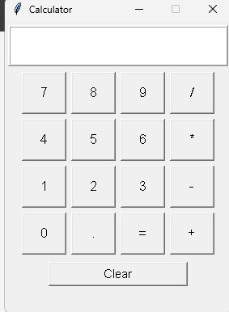
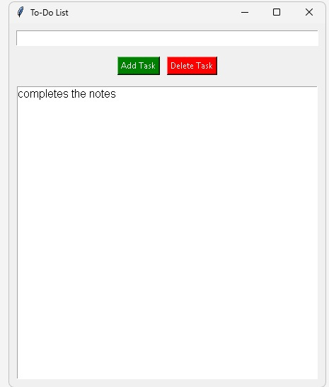

# CodSoft Python Internship Projects

This repository contains the Python programming tasks completed for the CodSoft Internship.

## 📋 Tasks Completed

### Task 1: Calculator
A simple calculator built using Python that performs basic arithmetic operations like Addition, Subtraction, Multiplication, and Division.

**File:** `calculator1.py`

### Task 2: To-Do List 
A command-line To-Do List application to add, view, update, and delete tasks. It helps in managing daily tasks efficiently.

**File:** `todo.py`

### Task 3: Rock Paper Scissors Game
A classic Rock-Paper-Scissors game where the user plays against the computer. The computer's choice is generated randomly.

**File:** `rock_paper_scissors.py`

## 📸 Output Screenshots

### 1. Calculator

### 2. To-Do List 

### 3. Rock Paper Scissors

## 🚀 How to Run
1. Clone the repository: `git clone https://github.com/raikholaankita/CodSoft-Python-Project`
2. Navigate to the folder
3. Run any file using: `python filename.py`

## 🔗 Connect with Me
**Name:** Ankita Raikhola  
**GitHub:** [@raikholaankita](https://github.com/raikholaankita)
